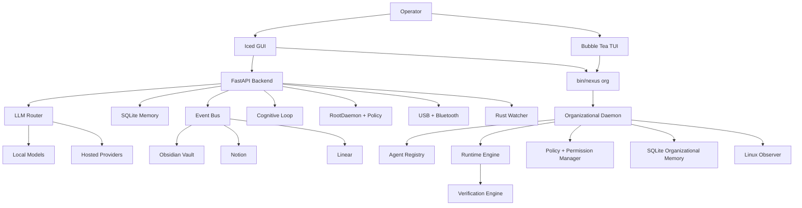

# NEXUS by NEXUS Protocol

> Local-first cognitive operations for Linux desktops. Current focus:
> persistent organizational runtime, verifiable execution, and supervised
> autonomy.

NEXUS is a local cognitive operating layer for Linux. It is being shaped as an
operational organization inside the workstation: agents plan, review, observe,
request approvals, execute through an auditable runtime, verify outcomes, and
write memory.

The project must not behave like a chatbot that claims work was done without
evidence. The operational contract is:

```text
objective -> plan -> real execution -> validation -> evidence -> memory
```

## Current Capabilities

- **Organizational Daemon**: persistent runtime with event bus, blackboard,
  scheduler hooks, health reporting, state, and agent registry.
- **Agent Company Model**: CEO, CTO, Planner, Coder, Reviewer, Security,
  DevOps, Memory, and Observer roles are registered and can tick continuously.
- **Runtime Engine**: approved commands receive command ids, stdout/stderr
  artifacts, runtime events, exit codes, duration, and verification records.
- **Policy and Permission Gates**: command proposals include risk, impact,
  rollback guidance, approval status, and a queue that separates approval from
  execution.
- **Verification Engine**: execution results are checked before success is
  reported, and failures remain visible.
- **Organizational Memory**: SQLite-backed tasks, decisions, summaries,
  runtime events, verifications, observations, and agent ticks.
- **Observer Engine**: lightweight Linux context sensing classifies modes such
  as `IDLE`, `DEVELOPMENT`, `RESEARCH`, `DEEP_WORK`, and `MAINTENANCE`.
- **Iced GUI**: Rust dashboard with backend feedback, organizational status,
  approval details, execution controls, logs, and verification evidence.
- **Bubble Tea TUI Scaffold**: terminal operations center wired to real
  `nexus_core.organization` state. It requires Go to build.

## Repository Layout

| Path | Purpose |
| --- | --- |
| `apps/` | FastAPI app, routes, API backend, cognitive entrypoints |
| `configs/` | TOML configuration and systemd unit templates for the organizational runtime |
| `interfaces/` | TUI/HUD/GUI-facing interface projects |
| `nexus-iced/` | Unified Rust Iced GUI project |
| `nexus_core/organization/` | Persistent daemon, agents, policy, runtime, memory, observer, and health modules |
| `nexus_core/` | Core orchestration, security, cognition, memory, integrations |
| `bin/` | Unified launcher for backend and Rust Iced GUI |
| `core-rust/` | Rust workspace for memory, sensors, policy, state, and bridges |
| `watcher_rs/` | Rust watcher service |
| `requirements/` | Python dependency profiles |
| `tests/` | Unit, integration, and system tests |
| `.github/workflows/` | CI for Python, Rust, CodeQL, and security scanning |

## Requirements

NEXUS targets Debian, Ubuntu, and Linux Mint style systems.

- Python 3.10 or 3.12
- Rust stable with `cargo`
- Optional: Go for the Bubble Tea TUI
- `python3-venv`, `python3-dev`, `build-essential`
- `libudev-dev` for device monitoring tests and integrations
- Rust environment for the Iced GUI and core services
- Optional: Ollama for local model routing

Example system packages:

```bash
sudo apt update
sudo apt install -y \
  python3-venv python3-dev build-essential libudev-dev
```

## Quick Start

```bash
git clone https://github.com/zeusinfra/NEXUS.git
cd NEXUS

./scripts/bootstrap.sh
source .venv/bin/activate

cp .env.example .env
```

Run the default Rust Iced GUI:

```bash
./bin/nexus
```

Run specific modes:

```bash
./bin/nexus iced
./bin/nexus server
./bin/nexus ensure-server
```

Run the organizational runtime:

```bash
./bin/nexus org health
./bin/nexus org run
./bin/nexus org tick-agents
./bin/nexus org observe
```

Propose, approve, and execute a command with evidence:

```bash
./bin/nexus org propose-command --reason "check interpreter" -- python3 --version
./bin/nexus org approvals --status pending_approval
./bin/nexus org approve-command <proposal_id> --approved-by operator
./bin/nexus org execute-command <proposal_id> --agent operator
./bin/nexus org runtime-events --limit 5
./bin/nexus org verifications --limit 5
```

Prepare user-level systemd operation:

```bash
./bin/nexus org systemd-plan
./bin/nexus org systemd-unit
./bin/nexus org systemd-install --write
./bin/nexus org systemd-control start --execute
```

The systemd helpers are explicit by design. Planning is dry-run by default;
writing the unit requires `--write`; calling `systemctl` requires `--execute`.

Build the Rust workspaces:

```bash
cargo build --manifest-path core-rust/Cargo.toml
cargo build --manifest-path watcher_rs/Cargo.toml
cargo build --manifest-path nexus-iced/Cargo.toml
```

## Common Commands

| Command | Description |
| --- | --- |
| `pip install -r requirements/base.txt` | Install base dependencies |
| `pip install -r requirements/dev.txt` | Install development dependencies |
| `make bootstrap` | Create `.venv` and install development dependencies |
| `make lint` | Run Python lint checks |
| `make test` | Run the Python test suite |
| `make rust` | Run Rust format, clippy, and tests |
| `make ci` | Run the main local CI gate |
| `./bin/nexus help` | Show launcher commands |
| `./bin/nexus org health` | Show daemon health and heartbeat status |
| `./bin/nexus org memory-status` | Show organizational memory counters |
| `./bin/nexus org approvals` | List command approval queue |
| `./bin/nexus org runtime-events` | List runtime execution events |
| `./bin/nexus org verifications` | List verification evidence |
| `./bin/nexus tui` | Run the Bubble Tea operations center when Go is installed |

## Configuration

Copy `.env.example` to `.env` and enable only the integrations you need.

Important settings:

- `NEXUS_LLM_PROVIDER`: `ollama`, `openai`, `gemini`, or local defaults
- `NEXUS_LLM_URL`: hosted or local LLM endpoint
- `NEXUS_DB_PATH`: SQLite event and cognition database path
- `NEXUS_VAULT_PATH`: local knowledge vault path
- `NEXUS_AUTONOMY_LEVEL`: guarded execution mode
- `NEXUS_ENABLE_SECOND_BRAIN`: enable Second Brain workers
- `NEXUS_ENABLE_VOICE_SENSING`: enable voice sensing
- `NEXUS_ENABLE_BROWSER_SENSING`: enable browser sensing
- `NEXUS_PROJECT_ROOT`: project root used by the organizational runtime
- `NEXUS_EXECUTION_MODE`: execution mode used by the command ledger
- `NEXUS_CMD_ALLOWLIST`: command allowlist for guarded execution

Secrets belong in local environment files or secret managers. Do not commit
real API keys, tokens, private keys, database dumps, or personal vault content.

## Architecture



## Security Model

NEXUS assumes local-first operation and treats system-level execution as a
security boundary.

- The organizational runtime separates proposal, approval, execution, and
  verification.
- Commands must be visible before approval.
- Approval does not execute a command automatically.
- Executions produce command ids, stdout/stderr artifacts, exit status,
  runtime events, and verification records.
- High-risk commands include impact and rollback guidance.
- RootDaemon communicates over a restricted Unix socket.
- Privileged actions are classified before execution.
- Dangerous command patterns are blocked by policy.
- Higher-risk actions require explicit approval context.
- Audit logs record command, caller, risk, reason, and outcome.
- Tests isolate runtime paths to avoid touching developer state.

Read [SECURITY.md](SECURITY.md) before changing command policy, RootDaemon,
authentication, token handling, network exposure, or filesystem boundaries.

## Testing

```bash
python -m ruff check .
python -m ruff format --check .
python -m pytest
python -m pytest -q tests/unit/test_organization_daemon.py tests/unit/test_organization_security.py tests/unit/test_organization_memory.py tests/unit/test_organization_runtime.py tests/unit/test_organization_observer.py tests/unit/test_organization_health.py
cd core-rust && cargo test --all-targets
cd ../watcher_rs && cargo test --all-targets
cargo check --manifest-path nexus-iced/Cargo.toml
```

CI currently covers Python 3.10 and 3.12, Rust checks, CodeQL analysis, secret
scanning, and Trivy filesystem scanning.

## Contributing

Contributions are welcome. Start with [CONTRIBUTING.md](CONTRIBUTING.md), and
follow the [Code of Conduct](CODE_OF_CONDUCT.md).

Security-sensitive reports should not be opened as public issues. Use the
process in [SECURITY.md](SECURITY.md).

## License

NEXUS is released under the [MIT License](LICENSE).
