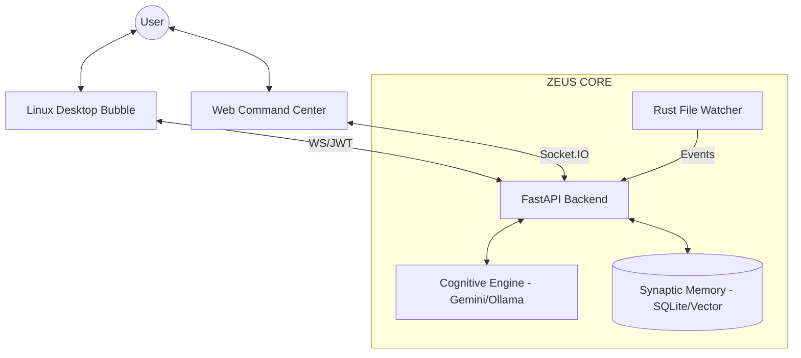
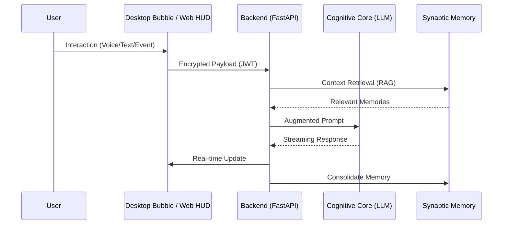

# 🧠 ZEUS — Cognitive Operating System & Neural Interface

[]()
[]()
[]()
[](LICENSE)

**ZEUS** is a modular, high-performance cognitive system designed to bridge human intent and machine execution. It integrates advanced LLMs, real-time vision, streaming voice synthesis, and autonomous system monitoring into a unified, neural-responsive command center.

---

## 🌌 System Vision

ZEUS is not just an assistant; it is a **Neural Interface** that decentralizes intelligence across your workspace. By combining high-speed Rust backends with the cognitive flexibility of Gemini and Ollama, ZEUS creates a persistent, evolving digital presence.

---

## 🏗️ Synaptic Architecture

The system operates through a polyglot orchestration layer, ensuring low-latency responses and robust memory retention.

### High-Level Flow


### Cognitive Pipeline


---

## 🚀 Key Capabilities

- **🎙️ Neural Voice Pipeline**: Sentence-by-sentence streaming for near-zero latency interaction.
- **👁️ Vision & Context Awareness**: Real-time analysis of screen, web, and local file states.
- **🦀 Rust-Powered Sensors**: High-performance filesystem monitoring via `watcher_rs` for instant event detection.
- **Desktop Bubble (Linux Overlay)**: A frameless, transparent, always-on-top Flutter application that acts as a living, breathing entity on your desktop. Activated instantly via `Alt+Space`.
- **🧠 Advanced Memory**: Hybrid Relational (SQLite) and Vector (JSON/Embeddings) memory hierarchy.

---

## 🛠️ Technical Stack

- **Backend**: Python 3.10+ (FastAPI, Socket.IO)
- **Cognitive**: Gemini Pro API / Ollama (Local Fallback)
- **Performance**: Rust (System Monitoring & Resource Intensive Tasks)
- **Frontend**: 
  - **Web**: Vanilla JS / HTML5 (Modern HUD Design)
  - **Desktop Overlay**: Flutter (Dart) compiled natively for Linux.
- **Infrastructure**: WebSocket-based real-time synchronization with JWT security.

---

## 🏁 Getting Started

### 1. Synchronization
Clone the repository and initialize the environment:
```bash
git clone https://github.com/geniusdev-tech/zeusOS.git
cd zeusOS
./bin/setup  # Optional setup script if available
```

### 2. Environment Configuration
Create a `.env` file based on `.env.example`:
```env
GEMINI_API_KEY=your_key_here
ZEUS_MOBILE_TOKEN=secure_token_here
ALLOW_LAN=true
```

### 3. Execution
Launch the core modules using the unified binary:
```bash
chmod +x bin/zeus
./bin/zeus web      # Launch Web Command Center
./bin/zeus watcher  # Launch Rust File Sensor
```

---

## 🫧 Desktop Overlay Deployment

The **ZEUS Cognitive Bubble** is located in `zeus_extension/`.
1. Ensure Flutter and Linux native dependencies (`gstreamer-1.0`, `clang`, `lld`, `keybinder-3.0`) are installed.
2. Run the provided launcher script to compile and start both the backend and the bubble:
   ```bash
   chmod +x bin/zeus-desktop.sh
   ./bin/zeus-desktop.sh
   ```
3. Use the global shortcut `Alt+Space` to focus the bubble.

---

## 📜 Repository Structure

- `apps/`: Main entry points and service orchestrators.
- `zeus_core/`: Cognitive logic, memory managers, and agent strategies.
- `watcher_rs/`: High-performance Rust file monitoring.
- `zeus_extension/`: Flutter Linux Desktop Overlay (The Cognitive Bubble).
- `docs/`: Technical specifications and system analysis.

---

> [!TIP]
> Use the `bin/zeus` command-line utility for the most streamlined experience across all system components.

---
*ZEUS — The ultimate interface between human intelligence and machine cognition.*

