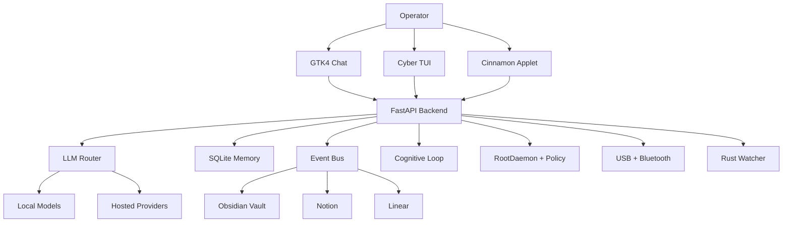

# NEXUS by NEXUS Protocol

> Local-first cognitive operations for Linux desktops. Phase 4: Organic Brain.

NEXUS is an autonomous cognitive operating layer that helps a Linux operator
observe, reason about, and act on a local workstation. It features a tiered 
memory system with high-performance Rust synapses, an autonomous architect for 
self-evolution, and a ubiquitous brain engine for cross-device state sync.

## Key Evolutions (Phase 4/5)

- **Organic Memory**: Tiered architecture (L1/L2/L3) with a native Rust Synapse core for high-performance associative memory.
- **Ubiquitous Brain**: `SyncEngine` for neural snapshot synchronization across multiple devices via global relay.
- **Architect Agent**: Autonomous software engineering agent capable of project blueprinting, code generation, and self-auditing.
- **Bio-Organic TUI**: Real-time terminal monitor with neural pulse (sparkline) and biological event terminology.
- **Synaptic 3D**: Real-time visualization of the neural network using Three.js.
- **Proactive Observation**: Situational awareness via adaptative screen capture and multi-modal analysis.

## Repository Layout

| Path | Purpose |
| --- | --- |
| `apps/` | FastAPI app, routes, web GUI, cognitive entrypoints |
| `nexus_core/` | Core orchestration, security, cognition, memory, integrations |
| `bin/` | Launchers for backend, GTK chat, TUI, and local helpers |
| `core-rust/` | Rust workspace for memory, sensors, policy, state, and bridges |
| `watcher_rs/` | Rust watcher service |
| `applets/` | Cinnamon desktop applet |
| `requirements/` | Python dependency profiles |
| `tests/` | Unit, integration, and system tests |
| `.github/workflows/` | CI for Python, Rust, CodeQL, and security scanning |

## Requirements

NEXUS targets Debian, Ubuntu, and Linux Mint style systems.

- Python 3.10 or 3.12
- Rust stable with `cargo`
- `python3-venv`, `python3-dev`, `build-essential`
- `libudev-dev` for device monitoring tests and integrations
- GTK4/Libadwaita packages for the desktop chat
- Optional: Ollama for local model routing

Example system packages:

```bash
sudo apt update
sudo apt install -y \
  python3-venv python3-dev build-essential libudev-dev \
  python3-gi gir1.2-gtk-4.0 gir1.2-adw-1 libadwaita-1-0
```

## Quick Start

```bash
git clone https://github.com/nexusinfra/NEXUS.git
cd NEXUS

./scripts/bootstrap.sh
source .venv/bin/activate

cp .env.example .env
```

Run the default terminal operator surface:

```bash
./bin/nexus
```

Run specific surfaces:

```bash
./bin/nexus tui
./bin/nexus chat
./bin/nexus server
./bin/nexus ensure-server
```

Build the Rust workspaces:

```bash
cargo build --manifest-path core-rust/Cargo.toml
cargo build --manifest-path watcher_rs/Cargo.toml
```

## Common Commands

| Command | Description |
| --- | --- |
| `pip install -r requirements/base.txt` | Install base dependencies |
| `pip install -r requirements/dev.txt` | Install development dependencies |
| `make bootstrap` | Create `.venv` and install development dependencies |
| `make lint` | Run Python lint checks |
| `make test` | Run the Python test suite |
| `make rust` | Run Rust format, clippy, and tests |
| `make ci` | Run the main local CI gate |
| `./bin/nexus help` | Show launcher commands |
| `./bin/install-cinnamon-applet.sh` | Install the Cinnamon applet locally |

## Configuration

Copy `.env.example` to `.env` and enable only the integrations you need.

Important settings:

- `NEXUS_LLM_PROVIDER`: `ollama`, `openai`, `gemini`, or local defaults
- `NEXUS_LLM_URL`: hosted or local LLM endpoint
- `NEXUS_DB_PATH`: SQLite event and cognition database path
- `NEXUS_VAULT_PATH`: local knowledge vault path
- `NEXUS_AUTONOMY_LEVEL`: guarded execution mode
- `NEXUS_ENABLE_SECOND_BRAIN`: enable Second Brain workers
- `NEXUS_ENABLE_VOICE_SENSING`: enable voice sensing
- `NEXUS_ENABLE_BROWSER_SENSING`: enable browser sensing

Secrets belong in local environment files or secret managers. Do not commit
real API keys, tokens, private keys, database dumps, or personal vault content.

## Architecture



## Security Model

NEXUS assumes local-first operation and treats system-level execution as a
security boundary.

- RootDaemon communicates over a restricted Unix socket.
- Privileged actions are classified before execution.
- Dangerous command patterns are blocked by policy.
- Higher-risk actions require explicit approval context.
- Audit logs record command, caller, risk, reason, and outcome.
- Tests isolate runtime paths to avoid touching developer state.

Read [SECURITY.md](SECURITY.md) before changing command policy, RootDaemon,
authentication, token handling, network exposure, or filesystem boundaries.

## Testing

```bash
python -m ruff check .
python -m ruff format --check .
python -m pytest
cd core-rust && cargo test --all-targets
cd ../watcher_rs && cargo test --all-targets
```

CI currently covers Python 3.10 and 3.12, Rust checks, CodeQL analysis, secret
scanning, and Trivy filesystem scanning.

## Contributing

Contributions are welcome. Start with [CONTRIBUTING.md](CONTRIBUTING.md), and
follow the [Code of Conduct](CODE_OF_CONDUCT.md).

Security-sensitive reports should not be opened as public issues. Use the
process in [SECURITY.md](SECURITY.md).

## License

NEXUS is released under the [MIT License](LICENSE).
