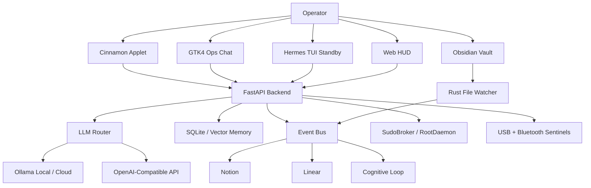

# NEXUS by ZEUS Protocol

> A local-first cognitive operating layer for Linux.

| Domain | Status | Primary Surface |
| --- | --- | --- |
| Desktop operations | Active | Cinnamon applet + GTK4/Libadwaita chat |
| Backend orchestration | Active | FastAPI, event bus, LLM router |
| Memory | Active | SQLite conversation recall + Second Brain events |
| Security | Active | SudoBroker, RootDaemon, approval gates |
| Peripherals | Active | USB/Bluetooth sentinels with spoken alerts |
| Integrations | Active | Obsidian, Notion, Linear |

## Executive Overview

ZEUS is a local-first cognitive operating system layer. It combines a FastAPI backend, local/cloud Ollama routing, OpenAI-compatible fallback support, realtime HUD telemetry, GTK4 desktop operations, voice and vision tools, Rust-based file watching, secure privileged-action approval, and a bi-directional Second Brain connecting Obsidian, Notion, and Linear.

The product direction is desktop-native: the **Cinnamon applet** is the launch and status surface, while the **GTK4 + Libadwaita chat** is the primary operator console. The Hermes-style TUI remains available as a standby/experimental terminal console, and the web HUD remains available for visualization and browser-based telemetry.

Current default LLM profile:

| Setting | Default |
| --- | --- |
| Provider | Ollama through local daemon |
| Model | `gemma4:31b-cloud` |
| Backend URL | `http://127.0.0.1:8080` |
| Security posture | Local-only by default |

## Current Operating State

Updated: **2026-05-10**

| Capability | State | Notes |
| --- | --- | --- |
| GTK Ops Chat | Production path | Multiline composer, command palette, sidebar, local SQLite history, message actions |
| Hermes-style TUI | Standby | Terminal fallback with multiline input, history, slash commands, live progress/tool logs |
| Conversation Recall | Active | `SQLiteConversationMemory` persists turns by `session_id` and `client_id` |
| Admin Approval Gates | Active | Pending/propose/allow/deny workflow; UI approves by `action_id` |
| RootDaemon Hardening | Active | `0660` socket, safe systemd validation, tokenized allowlist |
| Self-Healing Guardrails | Active | Policy validation before autonomous patches and command execution |
| Cognitive Loop Stability | Active | Safer loop behavior, dict/goal compatibility, runtime guardrails |
| USB Sentinel | Active | Detects hotplug, classifies device risk, speaks local alerts without GUI |
| Bluetooth Sentinel | Active | Monitors BlueZ events through `bluetoothctl monitor` |

## Architecture



## Repository Map

| Path | Responsibility |
| --- | --- |
| `apps/` | FastAPI app, realtime hub, status routes, lifecycle orchestration |
| `zeus_core/` | Agents, policies, LLM routing, security, memory, vision, event bus, observability |
| `zeus_core/peripherals/` | USB and Bluetooth sentinels |
| `public/` | Web HUD and frontend tests |
| `applets/` | Linux desktop panel integrations, currently Cinnamon `zeus@local` |
| `bin/zeus` | Unified launcher for server, web, TUI, and diagnostics |
| `bin/zeus-chat` | Desktop launcher that opens the GTK operator console |
| `bin/zeus-gtk-chat` | Primary GTK4/Libadwaita operator console |
| `bin/zeus-hermes-tui` | Standby terminal console with live progress/tool output |
| `watcher_rs/` | Rust filesystem watcher |
| `core-rust/` | Rust workspace for state, policy, sensors, security, and cognitive primitives |
| `docs/` | Architecture and system reports |
| `tests/` | Python regression, security, route, policy, and observability tests |

## Environment

Use `.env.example` as the local template. Never commit `.env`.

### Recommended Local Profile

```env
ZEUS_ENV=local
ZEUS_LLM_PROVIDER=ollama
ZEUS_LLM_URL=http://127.0.0.1:11434/api/chat
ZEUS_LLM_MODEL=gemma4:31b-cloud
ZEUS_PREFER_OLLAMA=1
ZEUS_DISABLE_OLLAMA=0
ZEUS_ALLOW_LAN=0
ZEUS_LAN_AUTH=1
ZEUS_ALLOW_INSECURE_DEV_SECRET=0

ZEUS_ENABLE_VOICE=1
ZEUS_ENABLE_VOICE_SENSING=0
ZEUS_ENABLE_SECOND_BRAIN=1
ZEUS_ENABLE_SECOND_BRAIN_SYNC_ENGINE=0
ZEUS_ENABLE_NOTION_AUTO_SYNC=1
ZEUS_ENABLE_OBSIDIAN_AUTO_SYNC=1
ZEUS_ENABLE_LINEAR_AUTO_SYNC=1

ZEUS_VAULT_PATH=/home/zeus/Documentos/Brain
ZEUS_DB_PATH=./zeus_events.db
ZEUS_CONVERSATION_DB_PATH=./data/conversation_memory.db
```

### Resource Governance

```env
ZEUS_RAM_SOFT_LIMIT=75
ZEUS_RAM_HARD_LIMIT=90
ZEUS_SWAP_WARNING_LIMIT=50
ZEUS_LOW_MEM_AUTO=1
```

### Integrations

```env
NOTION_TOKEN=your_notion_token
NOTION_DATABASE_ID=your_database_id
LINEAR_API_KEY=your_linear_key
LINEAR_TEAM_ID=your_team_id
ZEUS_ENABLE_NOTION=true
ZEUS_ENABLE_LINEAR=true
```

### Ollama Cloud

```bash
ollama signin
```

Hosted Ollama API:

```env
OLLAMA_API_KEY=your_ollama_api_key_here
ZEUS_LLM_API_KEY=your_ollama_api_key_here
```

OpenAI-compatible profile:

```env
ZEUS_LLM_PROVIDER=openai
OPENAI_API_KEY=your_openai_api_key_here
OPENAI_MODEL=gpt-4o-mini
OPENAI_BASE_URL=https://api.openai.com/v1
```

## Runbook

| Task | Command |
| --- | --- |
| Start backend headless | `./bin/zeus server` |
| Ensure backend is online | `./bin/zeus ensure-server` |
| Open web HUD | `./bin/zeus web` |
| Open GTK chat | `./bin/zeus chat` |
| Open TUI standby | `./bin/zeus tui` |
| Tail backend logs | `./bin/zeus logs` |

Manual backend start:

```bash
source .venv/bin/activate
python -m apps.web_gui --headless
```

Health endpoint:

```text
http://127.0.0.1:8080/api/health
```

## Desktop Components

### Cinnamon Applet

```bash
chmod +x bin/install-cinnamon-applet.sh
./bin/install-cinnamon-applet.sh
cinnamon-settings applets
```

Enable **ZEUS Cognitive AI** in Cinnamon Applets.

Click behavior:

| Backend State | Action |
| --- | --- |
| Online | Opens `bin/zeus-chat` (`bin/zeus-gtk-chat`) |
| Offline | Runs `./bin/zeus ensure-server` |

Reload applet if Cinnamon does not refresh:

```bash
gdbus call --session --dest org.Cinnamon --object-path /org/Cinnamon --method org.Cinnamon.ReloadXlet zeus@local APPLET
```

### GTK4 Ops Chat

Dependencies for Debian, Ubuntu, and Linux Mint:

```bash
sudo apt install python3-gi gir1.2-gtk-4.0 gir1.2-adw-1 libadwaita-1-0
```

Launch:

```bash
./bin/zeus chat
```

Direct GTK launcher:

```bash
./bin/zeus-gtk-chat
```

Theme override:

```bash
ZEUS_GTK_THEME=dark ./bin/zeus-gtk-chat
```

### Hermes-Style TUI Standby

The TUI uses `prompt_toolkit` and `rich`, matching the Hermes Agent interaction model: multiline input, command history, slash-command completion, live `AGENT_PROGRESS`, and `TOOL_LOG` output while the backend works. It is kept as standby while GTK remains the default.

```bash
./bin/zeus tui
```

```bash
./bin/zeus-hermes-tui
```

Shortcuts:

| Shortcut | Action |
| --- | --- |
| `Enter` | Send message |
| `Shift+Enter` | Insert newline |
| `Ctrl+K` | Command palette |
| `Ctrl+L` | Clear local chat view |
| `Esc` | Cancel current generation |

## Security Model

ZEUS defaults to local-only operation and treats privileged actions as explicit, auditable workflows.

| Layer | Control |
| --- | --- |
| HTTP access | Trusted local/LAN checks |
| LAN mode | `ZEUS_ALLOW_LAN=1`, `ZEUS_LAN_AUTH=1`, strong `ZEUS_LAN_TOKEN` |
| Payload limits | Chat, web-context, and vision payload caps |
| Privilege escalation | `SudoBroker` and `RootDaemon` only |
| Admin UI | Approval by `action_id`; no raw privileged command from client |
| Self-healing | `command_policy` validation, no `shell=True` |
| Runtime secrets | `.env`, keys, logs, databases, and scratch data remain untracked |

Admin approval API:

```text
GET  /api/admin/actions/pending
POST /api/admin/actions/propose
POST /api/admin/actions/{id}/allow
POST /api/admin/actions/{id}/deny
```

## Peripheral Sentinel

The USB Sentinel runs in the backend and does not require the GUI to be open. It watches `udev`, filters duplicate low-level interface events, classifies risk, stores operational alerts, and speaks through the local voice pipeline.

| Device Class | Risk | Action |
| --- | --- | --- |
| USB storage | Medium | Alert, discourage auto-execution, recommend scan before opening files |
| HID keyboard/mouse | Medium | Alert for potential BadUSB-style input |
| USB network/modem | High | Alert and recommend network-interface review |
| Audio/video | Low | Log and monitor |
| Unknown without serial | Medium | Alert due to low traceability |

## Test Matrix

Python:

```bash
.venv/bin/python -m pytest -q
```

Frontend:

```bash
node --test public/tests/*.test.js
```

Rust:

```bash
cargo test --manifest-path core-rust/Cargo.toml
cargo test --manifest-path watcher_rs/Cargo.toml
```

## Repository Hygiene

Before pushing to a public remote:

```bash
git status --short
git ls-files | rg "^(configs/.*\\.pem|logs/|.*\\.log$|startup_test|scratch/|data/|.*\\.db$|.*\\.sqlite$|\\.env$|\\.env\\.)"
rg -l "(sk-[A-Za-z0-9_-]{20,}|AIza[0-9A-Za-z_-]{20,}|mongodb\\+srv://|postgresql://|hvs\\.|private_key|serviceAccountKey)" --glob '!data/**' --glob '!logs/**' --glob '!scratch/**'
```

Expected result: no tracked secrets. `.env.example` may appear in scans because it intentionally contains placeholder names.

## Git Remote

Primary remote:

```text
origin -> https://github.com/zeusinfra/ZEUS_NEXUS.git
```
