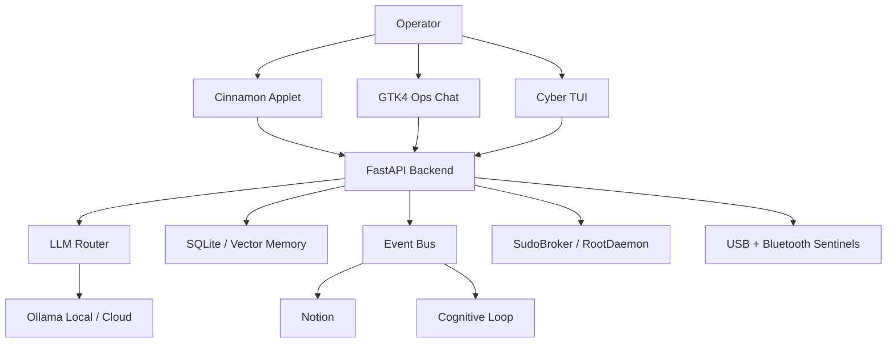

# NEXUS by ZEUS Protocol

> A local-first cognitive operating layer for Linux.

<div align="center">
  <!-- TODO: Substituir por um GIF real da interface GTK4 -->
  
</div>

## What is NEXUS?

NEXUS is an autonomous, privacy-first cognitive layer that acts as an intelligent supervisor for your Linux desktop environment. It seamlessly combines a FastAPI backend, local/cloud Ollama routing, realtime HUD telemetry, GTK4 desktop operations, voice and vision tools, Rust-based file watching, and a bi-directional "Second Brain" connecting Obsidian, Notion, and Linear.

Unlike standard LLM wrappers, NEXUS features a **RootDaemon** and **SudoBroker** architecture, allowing it to safely perform privileged system actions under explicit, tokenized human approval via a premium GTK interface.

## Quick Start

### 1. System Requirements

NEXUS runs best on Debian, Ubuntu, or Linux Mint. You'll need Python 3.10+, Rust (`cargo`), and system dependencies for GTK4.

```bash
sudo apt update
sudo apt install python3-gi gir1.2-gtk-4.0 gir1.2-adw-1 libadwaita-1-0 python3-dev build-essential
```

### 2. Installation

```bash
git clone https://github.com/zeusinfra/ZEUS_NEXUS.git
cd ZEUS_NEXUS

# Setup Python Environment
python3 -m venv .venv
source .venv/bin/activate
pip install -r requirements-base.txt
pip install -r requirements.txt

# Setup Rust Components
cargo build --manifest-path core-rust/Cargo.toml
```

### 3. Launch

To start the primary GTK4/Libadwaita operator console:
```bash
./bin/zeus chat
```
*(For a terminal fallback with live progress/tool output, use `./bin/zeus tui`)*

---

## Features

- **GTK4 Ops Chat**: The primary operator console with a multiline composer, command palette, sidebar telemetry, and graphical action approvals.
- **Local-First AI**: Designed to default to local models via Ollama, ensuring zero data leakage for your desktop queries and system state.
- **RootDaemon Hardening**: A `0660` Unix socket handles privileged requests. High-risk AI intentions are intercepted, evaluated, and paused for explicit human UI approval.
- **Peripheral Sentinels**: Silently watches `udev` and `bluetoothctl` for USB/Bluetooth events, classifying hardware risks (e.g., BadUSB detection) and speaking local voice alerts.
- **Second Brain Orchestration**: Seamlessly connects your thoughts, tasks, and system events to Obsidian, Notion, and Linear.
- **Conversation Recall**: `SQLiteConversationMemory` persists contextual sessions natively for persistent agent memory.

## Architecture

NEXUS is built on a hybrid Python/Rust stack to guarantee both high-level cognitive orchestration and low-level system safety.



---

## Advanced Configuration & Internals

### Security Model

ZEUS defaults to local-only operation and treats privileged actions as explicit, auditable workflows.
- **HTTP access**: Trusted local/LAN checks only.
- **Privilege escalation**: Managed strictly by `RootDaemon`. No raw privileged commands from the client are allowed without human authorization.
- **Admin UI**: Approval by `action_id`.
- **Self-healing**: Command policy validation blocks high-risk shells (no `shell=True`).

### Environment Profile
Copy `.env.example` to `.env` to configure your instance.
- **Ollama / OpenAI**: `ZEUS_LLM_PROVIDER`, `OLLAMA_API_KEY`, `OPENAI_API_KEY`
- **Second Brain**: `NOTION_TOKEN`, `LINEAR_API_KEY`
- **Resource Governance**: Configurable RAM/Swap constraints via `ZEUS_RAM_HARD_LIMIT`.

### Testing Matrix
To verify the system integrity:
```bash
# Python suite
pytest tests/ -v

# Rust workspace
cargo test --manifest-path core-rust/Cargo.toml
```

### Desktop Applet Integration (Cinnamon)
```bash
./bin/install-cinnamon-applet.sh
```
Enable **ZEUS Cognitive AI** in Cinnamon Applets. Clicking the applet will bring up the GTK chat if online, or automatically bootstrap the server if offline.
