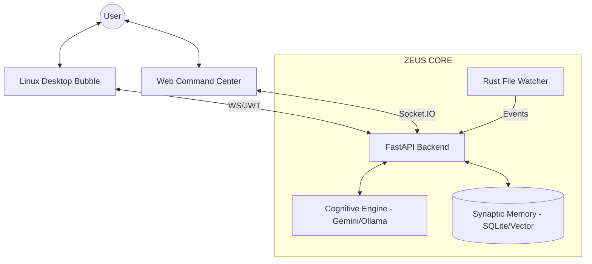
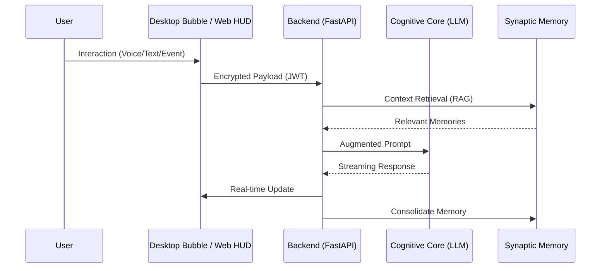

# 🧠 ZEUS: Cognitive Operating System & Neural Interface

[]()
[]()
[]()
[](LICENSE)

**ZEUS** is a modular, high-performance cognitive system designed to bridge human intent and machine execution. It integrates advanced LLMs, real-time vision, streaming voice synthesis, and autonomous system monitoring into a unified, **neural-responsive command center**.

---

## 🌌 The Vision

ZEUS is not just an assistant; it is a **Persistent Neural Interface** that decentralizes intelligence across your workspace. By combining high-speed Rust backends with the cognitive flexibility of Gemini and Ollama, ZEUS manifests as a living digital presence directly on your screen.

> [!NOTE]
> **The Cognitive Bubble:** The primary interface of ZEUS is a frameless, transparent, always-on-top Linux Desktop Overlay. It acts as a digital companion that breathes, listens, and speaks in real-time without interrupting your workflow.

---

## 🚀 Key Capabilities

* **🫧 The Cognitive Bubble**: A floating, organic Linux overlay. Hit `Alt+Space` to summon it instantly. It features a breathing animation reflecting its current neural state (Idle, Listening, Thinking, Speaking).
* **🎙️ Neural Voice Pipeline**: Sentence-by-sentence audio streaming via Base64 WebSocket chunks for near-zero latency interaction.
* **👁️ Vision & Context Awareness**: Real-time analysis of screen, web, and local file states.
* **🦀 Rust-Powered Sensors**: High-performance filesystem monitoring (`watcher_rs`) for instant, low-overhead event detection.
* **🧠 Advanced Synaptic Memory**: Hybrid Relational (SQLite) and Vector (SIMD-optimized Cosine Similarity) memory hierarchy.

---

## 🏗️ Architecture & Orchestration

The system operates through a polyglot orchestration layer, ensuring low-latency responses and robust memory retention.

### High-Level Flow


### Cognitive Pipeline


---

## 🛠️ Technical Stack

* 🐍 **Backend Core**: Python 3.10+ (FastAPI, Socket.IO)
* 🧠 **Cognitive Engine**: Gemini Pro API / Ollama (Local Fallback)
* 🦀 **Performance Layer**: Rust (System Monitoring, Vector Memory, SIMD Tasks)
* 🦋 **Frontend (Overlay)**: Flutter Desktop (Dart) natively compiled for Linux via GTK/Wayland.
* 🌐 **Frontend (Web)**: Vanilla JS / HTML5 (Modern HUD Design)

---

## 🫧 Quick Start: Launching the Bubble

> [!IMPORTANT]
> The ZEUS interface currently targets Linux Desktop environments.

### 1. Install OS Dependencies
Ensure you have the required native libraries for audio and global shortcuts:
```bash
sudo apt-get update
sudo apt-get install -y libgstreamer1.0-dev libgstreamer-plugins-base1.0-dev clang lld libkeybinder-3.0-dev
```

### 2. Environment Configuration
Create a `.env` file based on `.env.example`:
```env
GEMINI_API_KEY=your_key_here
ALLOW_LAN=false
```

### 3. Ignite the System
Launch the unified orchestration script to compile the Flutter bubble and start the headless Rust/Python backend:
```bash
chmod +x bin/zeus-desktop.sh
./bin/zeus-desktop.sh
```

> [!TIP]
> Use **`Alt+Space`** anywhere in your Linux system to focus the Bubble and start communicating!

---

## 📜 Repository Structure

| Directory | Purpose |
| --- | --- |
| `apps/` | Main Python entry points and FastAPI backend orchestrators. |
| `zeus_core/` | Cognitive logic, LLM agent strategies, and memory managers. |
| `core-rust/` | High-performance Rust modules (`watcher_rs`, `zeus_memory`). |
| `zeus_extension/` | Flutter Linux Desktop Overlay (The Cognitive Bubble). |
| `docs/` | Technical specifications, architecture reports, and analysis. |

---

<div align="center">
  <i>ZEUS — The ultimate interface between human intelligence and machine cognition.</i>
</div>
