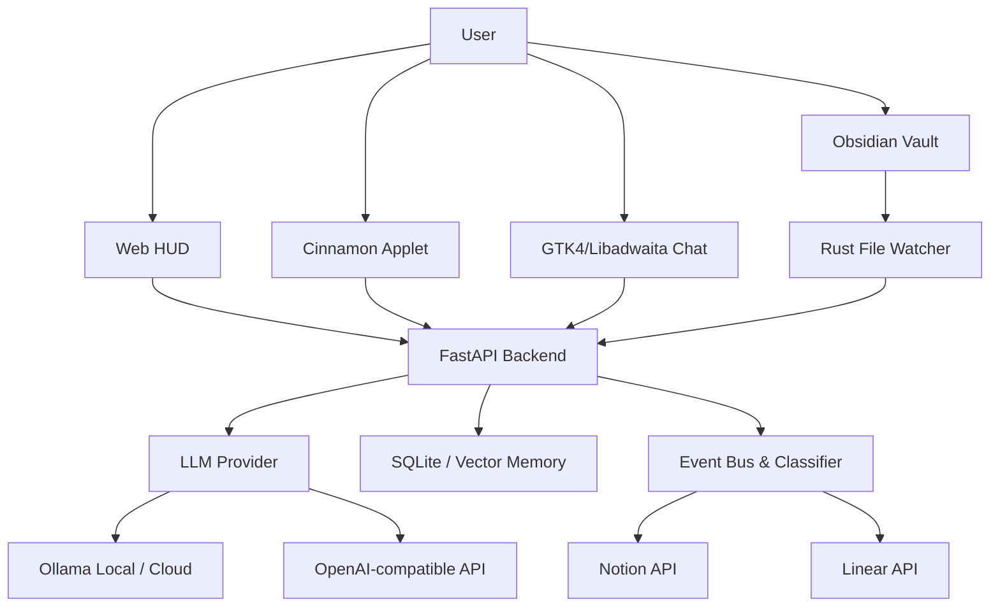

# ZEUS Cognitive OS

ZEUS is a local-first cognitive operating layer that combines a FastAPI backend, Ollama/OpenAI-compatible LLM routing, realtime HUD telemetry, voice/vision tools, Rust-based file watching, a Linux Mint/Cinnamon panel applet, and an event-driven **Second Brain Orchestrator** connecting Obsidian, Notion, and Linear.

The current default profile is **Ollama Cloud through the local Ollama daemon**, using `gemma4:31b-cloud` when the machine is authenticated with `ollama signin`.

Current product direction: **the Cinnamon applet is the primary desktop interface**. The desktop chat is a native **GTK4 + Libadwaita** application launched from the Cinnamon applet.

## Current Status (2026-05-09) - GTK Ops, Persistent Recall & Approval Gates

- **GTK4 Ops Chat:** Interface nativa ganhou composer multi-linha, command palette (`Ctrl+K`), sidebar recolhível, histórico local em SQLite, balões de conversa refinados e ações por mensagem.
- **Persistent Conversation Recall:** `SQLiteConversationMemory` persiste turnos por `session_id`/`client_id`, injeta histórico recente e recupera conversas parecidas antes de chamar o LLM.
- **Sudo Approval Gates:** Ações administrativas passam por propostas auditáveis com endpoints `pending/propose/allow/deny`; a GTK mostra cards **Allow/Deny** e nunca envia comando cru ao aprovar.
- **RootDaemon Hardening:** Socket restrito a `0660`, validação segura de unidades systemd e allowlist tokenizada para comandos read-only/baixo risco.
- **Self-Healing Guardrails:** Correções autônomas passam pelo `command_policy` e não usam `shell=True`.
- **Cognitive Loop Stability:** Loop cognitivo evita executor assíncrono instável no ambiente atual, corrige `LOOP_INTERVAL` removido e aceita metas como `dict` ou `CognitiveGoal`.

## Architecture



## Main Directories

| Path | Purpose |
| --- | --- |
| `apps/` | FastAPI app, realtime hub, status routes, orchestration entrypoints. |
| `zeus_core/` | Agentes, `SudoBroker`, `ResourceGovernor`, LLM routing, event bus, memória conversacional, `SelfImprovementPipeline`, observability. |
| `public/` | Web HUD and frontend tests. |
| `applets/` | Linux desktop panel integrations, currently Cinnamon `zeus@local`. |
| `bin/zeus-gtk-chat` | Premium native GTK4/Libadwaita desktop chat launched by the applet. |
| `watcher_rs/` | Rust filesystem watcher. |
| `core-rust/` | **Hybrid Core Workspace**: 8 crates Rust para estado compartilhado, políticas, segurança, sensores e lógica cognitiva. |
| `zeus_core/vision.py` | Módulo de captura de tela, OCR e análise visual via LLM. |
| `docs/` | Technical reports and execution plans. |
| `tests/` | Python regression, security, policy, route, and observability tests. |

## Environment

Use `.env.example` as the template for local configuration. Do not commit `.env`.

Recommended local/cloud Ollama profile:

```env
ZEUS_ENV=local
ZEUS_LLM_PROVIDER=ollama
ZEUS_LLM_URL=http://127.0.0.1:11434/api/chat
ZEUS_LLM_MODEL=gemma4:31b-cloud
ZEUS_PREFER_OLLAMA=1
ZEUS_DISABLE_OLLAMA=0
ZEUS_ALLOW_LAN=0
ZEUS_LAN_AUTH=1
ZEUS_ALLOW_INSECURE_DEV_SECRET=0

# Governança de Recursos
ZEUS_RAM_SOFT_LIMIT=75
ZEUS_RAM_HARD_LIMIT=90
ZEUS_SWAP_WARNING_LIMIT=50

# Second Brain Integrations
ZEUS_VAULT_PATH=/home/zeus/Documentos/Brain
ZEUS_DB_PATH=./zeus_events.db
NOTION_TOKEN=your_notion_token
NOTION_DATABASE_ID=your_database_id
LINEAR_API_KEY=your_linear_key
LINEAR_TEAM_ID=your_team_id
ZEUS_ENABLE_SECOND_BRAIN=1
ZEUS_ENABLE_SECOND_BRAIN_SYNC_ENGINE=0
ZEUS_ENABLE_NOTION_AUTO_SYNC=1
ZEUS_ENABLE_OBSIDIAN_AUTO_SYNC=1
ZEUS_ENABLE_LINEAR_AUTO_SYNC=1
ZEUS_ENABLE_NOTION=true
ZEUS_ENABLE_LINEAR=true
```

For Ollama Cloud via the local daemon:

```bash
ollama signin
```

For hosted Ollama API usage, configure one of:

```env
OLLAMA_API_KEY=your_ollama_api_key_here
ZEUS_LLM_API_KEY=your_ollama_api_key_here
```

For OpenAI-compatible usage:

```env
ZEUS_LLM_PROVIDER=openai
OPENAI_API_KEY=your_openai_api_key_here
OPENAI_MODEL=gpt-4o-mini
OPENAI_BASE_URL=https://api.openai.com/v1
```

## Run

Backend/headless:

```bash
source .venv/bin/activate
python -m apps.web_gui --headless
```

Backend health guard:

```bash
./bin/zeus ensure-server
```

### Linux Desktop Components

#### Cinnamon Applet:

```bash
chmod +x bin/install-cinnamon-applet.sh
./bin/install-cinnamon-applet.sh
cinnamon-settings applets
```

Then enable **ZEUS Cognitive AI** in Cinnamon Applets. The applet talks to the local backend through HTTP endpoints.
The applet shows backend/LLM status in the Cinnamon panel. Click behavior:
- backend online: opens the external GTK chat window from `bin/zeus-gtk-chat`;
- backend offline: runs `./bin/zeus ensure-server`.

#### Native GTK4 Chat:
The desktop client is built with **GTK4 and Libadwaita** for a native GNOME/Linux Mint experience. It includes a multiline composer, improved chat bubbles, local conversation history, command palette, collapsible telemetry sidebar, admin approval cards, toast notifications, live telemetry polling, and dark mode.

Dependencies for Debian/Ubuntu/Linux Mint:

```bash
sudo apt install python3-gi gir1.2-gtk-4.0 gir1.2-adw-1 libadwaita-1-0
```

The application respects the dark mode preference automatically but can be overridden:
```bash
ZEUS_GTK_THEME=dark ./bin/zeus-gtk-chat
```

GTK shortcuts and controls:

- `Enter`: send message.
- `Shift+Enter`: insert a new line.
- `Ctrl+K`: open the command palette.
- `Ctrl+L`: clear the local chat view.
- `Esc`: cancel the current generation.

Admin approval flow:

```text
GET  /api/admin/actions/pending
POST /api/admin/actions/propose
POST /api/admin/actions/{id}/allow
POST /api/admin/actions/{id}/deny
```

The GTK client only sends the approved `action_id`; the backend retrieves the audited proposal and calls `SudoBroker` with explicit user confirmation.

If Cinnamon does not reload the applet after installation, run:

```bash
gdbus call --session --dest org.Cinnamon --object-path /org/Cinnamon --method org.Cinnamon.ReloadXlet zeus@local APPLET
```

Web HUD:

```text
http://127.0.0.1:8080
```

## Test

Python:

```bash
.venv/bin/python -m pytest -q
```

Frontend:

```bash
node --test public/tests/*.test.js
```

Rust:

```bash
cargo test --manifest-path core-rust/Cargo.toml
cargo test --manifest-path watcher_rs/Cargo.toml
```

## Security And Repository Hygiene

The repository must not include local secrets, runtime memory, logs, screenshots, private keys, or temporary scratch data.

Ignored/local-only examples:

- `.env`
- `.env.*`
- `configs/*.pem`
- `configs/serviceAccountKey.json`
- `data/`
- `logs/`
- `scratch/`
- `*.db`
- `*.sqlite`
- `*.log`
- `startup_test*.log`

Runtime hardening currently enforced by the backend:

- `/api/status`, `/api/health`, `/api/chat`, `/api/web-context`, applet routes, ASR, and vision endpoints require trusted local/LAN access.
- LAN mode should set `ZEUS_ALLOW_LAN=1`, `ZEUS_LAN_AUTH=1`, and a strong `ZEUS_LAN_TOKEN`.
- `ZEUS_MAX_CHAT_MESSAGE_CHARS`, `ZEUS_MAX_WEB_CONTEXT_CHARS`, and `ZEUS_MAX_VISION_IMAGE_BYTES` cap user-provided payload sizes.
- Command execution uses `SudoBroker` para interceptar escalonamento indevido. Permissões estritas apenas via `RootDaemon`.
- RootDaemon uses a tokenized command allowlist and `0660` Unix socket permissions.
- Self-healing commands are validated by `command_policy` and executed without `shell=True`.
- Admin approvals are action-id based; UI clients do not submit arbitrary privileged commands.

Before pushing to a public remote, run:

```bash
git status --short
git ls-files | rg "^(configs/.*\\.pem|logs/|.*\\.log$|startup_test|scratch/|data/|.*\\.db$|.*\\.sqlite$|\\.env$|\\.env\\.)"
rg -l "(sk-[A-Za-z0-9_-]{20,}|AIza[0-9A-Za-z_-]{20,}|mongodb\\+srv://|postgresql://|hvs\\.|private_key|serviceAccountKey)" --glob '!data/**' --glob '!logs/**' --glob '!scratch/**'
```

Expected result: no tracked secrets. `.env.example` may appear in pattern scans because it intentionally contains placeholder variable names.

## Git Remote

Current GitHub remote:

```text
https://github.com/geniusdev-tech/zeus-cognitive-os.git
```

To push after review:

```bash
git push origin main
```

## Documentation

- `docs/RELATORIO_COMPLETO_SISTEMA_2026-05-08.md` (Latest: Adaptive Amplification & Secure Autonomy)
- `docs/ZEUS_SECOND_BRAIN_ARCHITECTURE.md`
