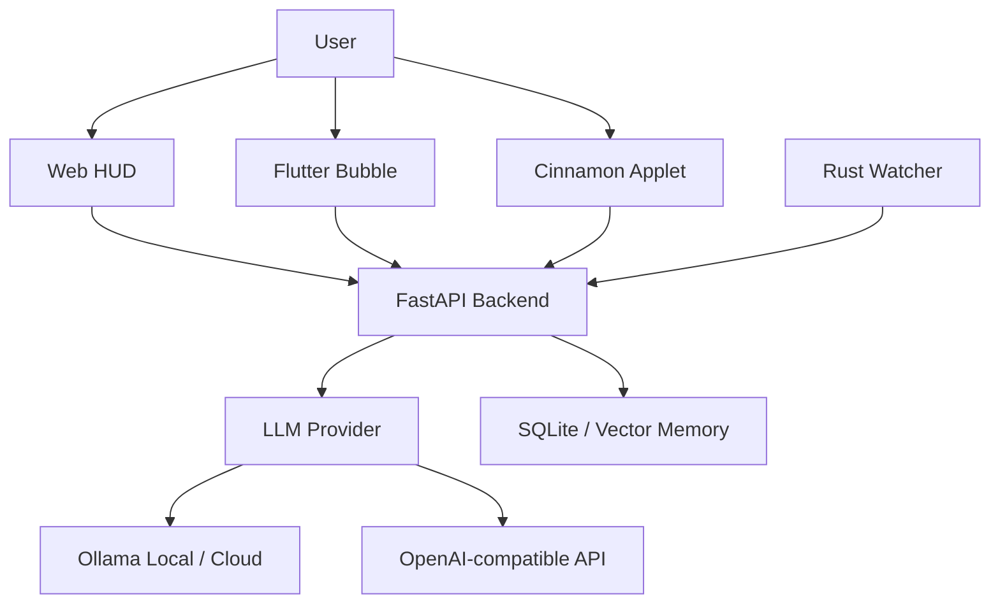

# ZEUS Cognitive AI

ZEUS is a local-first cognitive operating layer that combines a FastAPI backend, Ollama/OpenAI-compatible LLM routing, realtime HUD telemetry, voice/vision tools, Rust-based file watching, a Flutter desktop bubble, and a Linux Mint/Cinnamon panel applet.

The current default profile is **Ollama Cloud through the local Ollama daemon**, using `gemma4:31b-cloud` when the machine is authenticated with `ollama signin`.

## Current Status

- Backend: FastAPI + Socket.IO + native WebSocket.
- LLM: Ollama-first, with OpenAI/Gemini support available by environment variables.
- UI: Web HUD in `public/index.html`, Flutter bubble in `zeus_extension/`, and Cinnamon applet in `applets/cinnamon/zeus@local/`.
- Security: LAN access requires token when enabled; command execution uses allowlist, confirmation, and audit logging.
- Observability: structured JSON logs, request correlation-id, and health metrics.
- Tests: Python unit/contract tests plus Node tests for frontend behavior.

## Architecture



## Main Directories

| Path | Purpose |
| --- | --- |
| `apps/` | FastAPI app, realtime hub, status routes, orchestration entrypoints. |
| `zeus_core/` | LLM routing, agents, memory, security guards, command policy, observability. |
| `public/` | Web HUD and frontend tests. |
| `applets/` | Linux desktop panel integrations, currently Cinnamon `zeus@local`. |
| `zeus_extension/` | Flutter desktop bubble. |
| `watcher_rs/` | Rust filesystem watcher. |
| `core-rust/` | Rust memory/system components. |
| `docs/` | Technical reports and execution plans. |
| `tests/` | Python regression, security, policy, route, and observability tests. |

## Environment

Use `.env.example` as the template for local configuration. Do not commit `.env`.

Recommended local/cloud Ollama profile:

```env
ZEUS_ENV=local
ZEUS_LLM_PROVIDER=ollama
ZEUS_LLM_URL=http://127.0.0.1:11434/api/chat
ZEUS_LLM_MODEL=gemma4:31b-cloud
ZEUS_PREFER_OLLAMA=1
ZEUS_DISABLE_OLLAMA=0
ZEUS_ALLOW_LAN=0
ZEUS_LAN_AUTH=1
ZEUS_ALLOW_INSECURE_DEV_SECRET=0
```

For Ollama Cloud via the local daemon:

```bash
ollama signin
```

For hosted Ollama API usage, configure one of:

```env
OLLAMA_API_KEY=your_ollama_api_key_here
ZEUS_LLM_API_KEY=your_ollama_api_key_here
```

For OpenAI-compatible usage:

```env
ZEUS_LLM_PROVIDER=openai
OPENAI_API_KEY=your_openai_api_key_here
OPENAI_MODEL=gpt-4o-mini
OPENAI_BASE_URL=https://api.openai.com/v1
```

## Run

Backend/headless:

```bash
source .venv/bin/activate
python -m apps.web_gui --headless
```

Desktop bubble:

```bash
chmod +x bin/zeus-desktop.sh
./bin/zeus-desktop.sh
```

Linux Mint/Cinnamon applet:

```bash
chmod +x bin/install-cinnamon-applet.sh
./bin/install-cinnamon-applet.sh
cinnamon-settings applets
```

Then enable **ZEUS Cognitive AI** in Cinnamon Applets. The applet talks to the local backend through:

```text
GET  http://127.0.0.1:8080/api/applet/status
POST http://127.0.0.1:8080/api/applet/chat
POST http://127.0.0.1:8080/api/applet/voice/start
POST http://127.0.0.1:8080/api/applet/vision/analyze
```

The applet shows backend/LLM status in the Cinnamon panel and opens a compact popup with chat, voice, vision, HUD, and backend-start controls. If Cinnamon does not reload the applet after installation, restart Cinnamon with `Alt+F2`, type `r`, and press Enter, or log out and back in.

Web HUD:

```text
http://127.0.0.1:8080
```

## Test

Python:

```bash
python3 -m unittest discover tests
```

Frontend:

```bash
node --test public/tests/*.test.js
```

Rust:

```bash
cargo test --manifest-path core-rust/Cargo.toml
cargo test --manifest-path watcher_rs/Cargo.toml
```

## Security And Repository Hygiene

The repository must not include local secrets, runtime memory, logs, screenshots, private keys, or temporary scratch data.

Ignored/local-only examples:

- `.env`
- `.env.*`
- `configs/*.pem`
- `configs/serviceAccountKey.json`
- `data/`
- `logs/`
- `scratch/`
- `*.db`
- `*.sqlite`
- `*.log`
- `startup_test*.log`

Before pushing to a public remote, run:

```bash
git status --short
git ls-files | rg "^(configs/.*\\.pem|logs/|.*\\.log$|startup_test|scratch/|data/|.*\\.db$|.*\\.sqlite$|\\.env$|\\.env\\.)"
rg -l "(sk-[A-Za-z0-9_-]{20,}|AIza[0-9A-Za-z_-]{20,}|mongodb\\+srv://|postgresql://|hvs\\.|private_key|serviceAccountKey)" --glob '!data/**' --glob '!logs/**' --glob '!scratch/**'
```

Expected result: no tracked secrets. `.env.example` may appear in pattern scans because it intentionally contains placeholder variable names.

## Git Remote

Current GitHub remote:

```text
https://github.com/geniusdev-tech/zeus-cognitive-os.git
```

To push after review:

```bash
git push origin main
```

## Documentation

- `docs/RELATORIO_SISTEMA_2026-05-02.md`
- `docs/PLANO_EXECUCAO_ZEUS_2026-05-02.md`
- `docs/ANALISE_SISTEMA_DETALHADA.md`
