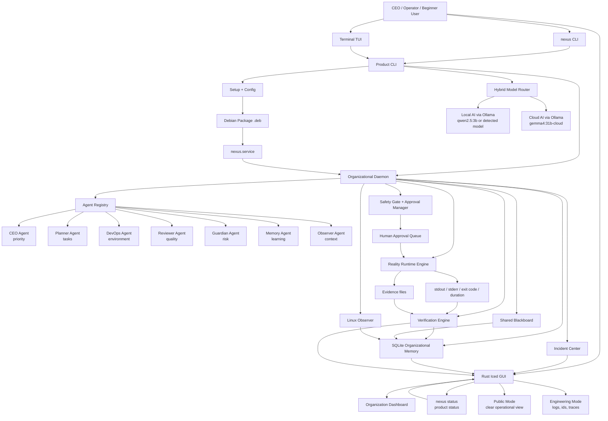

# NEXUS architecture flowchart

This diagram describes the current product direction: NEXUS as a Linux
installable Cognitive OS with hybrid local/cloud intelligence, supervised
execution, verification and organizational memory.

## Reading the system by role

CEO:

- reads mission, risk, approval queue and incident impact;
- does not need raw logs or internal IDs;
- can decide whether the operation should continue.

CTO:

- reads architecture, routing, daemon health, agent ownership and verification;
- uses Engineering Mode when technical evidence is needed;
- validates systemd, packaging, runtime and rollback details.

Beginner user:

- sees what NEXUS is doing, who is acting and whether it succeeded;
- sees local AI versus cloud AI without needing implementation details;
- approves only when the consequence is understandable.

## UI sections

- Overview: executive summary of platform, mission, swarm and health.
- Missions: objective, progress and next steps.
- Swarm: agents, responsibilities and handoff flow.
- Executions: real actions, result, verification and next step.
- Approvals: sensitive actions waiting for human decision.
- Incidents: summarized failures, severity and impact.
- Observer: current Linux context.
- Telemetry: four essential cognitive signals.
- Memory: decisions, events and organizational learning.
- Config: .deb install, daemon, local model, gemma4 cloud model and display mode.
