# NEXUS architecture flowchart

This diagram describes the current product direction: NEXUS as a Linux
installable Cognitive OS with a premium conversational UI, hybrid local/cloud
intelligence, supervised execution, verification, replay and organizational
memory.

```mermaid
flowchart TD
    CEO[CEO / Operator / Beginner User] --> GUI[Rust Iced Conversational GUI]
    CEO --> CLI[nexus CLI]
    CEO --> TUI[Terminal TUI]

    GUI --> ProductStatus[nexus status<br/>product status]
    GUI --> ChatSurface[Assistant Chat Surface]
    CLI --> ProductCLI[Product CLI]
    TUI --> ProductCLI

    ProductCLI --> Setup[Setup + Config]
    ProductCLI --> Router[Hybrid Model Router]
    ProductCLI --> OrgDaemon[Organizational Daemon]

    Setup --> DebPackage[Debian Package .deb]
    DebPackage --> Systemd[nexus.service]
    Systemd --> OrgDaemon

    Router --> LocalAI[Local AI via Ollama<br/>qwen2.5:3b or detected model]
    Router --> CloudAI[Cloud AI via Ollama<br/>gemma4:31b-cloud]

    OrgDaemon --> Blackboard[Shared Blackboard]
    OrgDaemon --> Agents[Agent Registry]
    OrgDaemon --> Runtime[Reality Runtime Engine]
    OrgDaemon --> Safety[Safety Gate + Approval Manager]
    OrgDaemon --> Observer[Linux Observer]
    OrgDaemon --> Memory[SQLite Organizational Memory]
    OrgDaemon --> Verification[Verification Engine]
    OrgDaemon --> WorkspaceContext[Workspace Memory]
    OrgDaemon --> Replay[Action Replay Builder]
    OrgDaemon --> ResourceBudget[Resource Governor]
    OrgDaemon --> SelfHealing[Self-Healing Diagnostics]

    Agents --> CEOAgent[CEO Agent<br/>priority]
    Agents --> Planner[Planner Agent<br/>tasks]
    Agents --> DevOps[DevOps Agent<br/>environment]
    Agents --> Reviewer[Reviewer Agent<br/>quality]
    Agents --> Guardian[Guardian Agent<br/>risk]
    Agents --> MemoryAgent[Memory Agent<br/>learning]
    Agents --> ObserverAgent[Observer Agent<br/>context]

    Safety --> ApprovalQueue[Human Approval Queue]
    ApprovalQueue --> Plan[Structured Execution Plan]
    Plan --> ResourceBudget
    ResourceBudget --> Runtime
    Runtime --> Logs[stdout / stderr / exit code / duration]
    Runtime --> Evidence[Evidence files]
    Logs --> Verification
    Evidence --> Verification
    Verification --> Replay
    SelfHealing --> Replay
    Runtime --> SelfHealing

    Verification --> Memory
    Plan --> Memory
    Replay --> Memory
    WorkspaceContext --> Memory
    Blackboard --> Memory
    Observer --> Memory
    OrgDaemon --> Incidents[Incident Center]

    GUI --> ChatSurface
    ChatSurface --> UserInput[Fixed Chat Input<br/>attachments, voice, send]
    ChatSurface --> Suggestions[Suggestion Cards<br/>summarize, organize, explain, plan]
    GUI --> DevMode[Optional Developer Mode<br/>plans, replay, evidence]

    ProductStatus --> GUI
    Incidents --> GUI
    Memory --> GUI
    Verification --> GUI
    Replay --> GUI
```

## Reading the system by role

CEO:

- reads mission, risk, approval queue and incident impact;
- does not need raw logs or internal IDs;
- can decide whether the operation should continue.

CTO:

- reads architecture, routing, daemon health, ownership, verification and
  replay;
- uses developer mode or CLI commands when technical evidence is needed;
- validates systemd, packaging, runtime, rollback and resource budget details.

Beginner user:

- sees what NEXUS is doing, who is acting and whether it succeeded;
- sees local AI versus cloud AI without needing implementation details;
- approves only when the consequence is understandable.

## UI sections

- Conversation: primary assistant experience and task intake.
- Suggestions: summarize document, organize tasks, explain project and create
  plan.
- Approvals: sensitive actions waiting for human decision.
- Executions: real actions, result, verification and next step.
- Replay: reconstructed command/task timelines for audit and debugging.
- Memory: decisions, workspace context, events and organizational learning.
- Developer Mode: optional plans, logs, IDs, stdout/stderr and resource budgets.
- Config: .deb install, daemon, local model, gemma4 cloud model and display
  mode.
