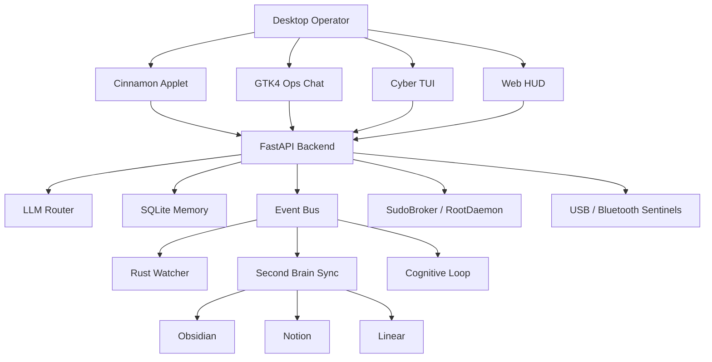

# NEXUS Cognitive OS - System Report

> Enterprise operating report for the current NEXUS platform state, architecture maturity, risk posture, validation status, and execution roadmap.

| Report Field | Value |
| --- | --- |
| Original date | 2026-05-08 |
| Last update | 2026-05-10 |
| Platform | NEXUS Cognitive OS |
| Operating model | Local-first cognitive desktop layer |
| Primary interface | Cinnamon applet + GTK4 Ops Chat |
| Backend | FastAPI, SQLite, Rust watcher, event bus |
| Security posture | Local-first, approval-gated, policy-controlled |

## Executive Summary

NEXUS has evolved from a mature monitoring assistant into a proactive cognitive operations platform. The system now combines autonomous planning, secure administrative workflows, desktop-native command surfaces, persistent memory, Second Brain synchronization, and peripheral sensing.

The latest operating milestone focuses on enterprise readiness:

| Theme | Outcome |
| --- | --- |
| Operational UX | GTK4 Ops Chat and Cinnamon applet define the desktop workflow |
| Governance | Admin actions are proposed, reviewed, approved by ID, and executed through controlled brokers |
| Memory | SQLite-backed conversation recall and Second Brain persistence reduce context loss |
| Security | RootDaemon, SudoBroker, command policy, and route trust checks constrain risk |
| Observability | Backend health, HUD telemetry, GTK sidebar, and structured logs improve traceability |
| Peripheral awareness | USB/Bluetooth sentinels detect and announce device changes headlessly |

## Platform Snapshot

| Capability | Current State | Maturity |
| --- | --- | --- |
| FastAPI backend | Active | Stable |
| GTK4 operator console | Active | Production path |
| Hermes-style TUI | Standby | Terminal fallback for live progress and tool logs |
| Cinnamon applet | Active | Primary launcher/status surface |
| Web HUD | Active | Visualization surface |
| LLM routing | Active | Ollama local/cloud plus OpenAI-compatible profile |
| SQLite conversation memory | Active | Stable |
| Second Brain sync | Active | Integration-ready |
| Rust watcher | Active | Stable |
| SudoBroker | Active | Hardened |
| RootDaemon | Active | Hardened |
| Self-healing pipeline | Active | Guarded |
| USB Sentinel | Active | Newly integrated |
| Bluetooth monitor | Active | Lightweight native monitor |

## Architecture State

## Governance And Autonomy

### Privileged Execution

| Component | Responsibility |
| --- | --- |
| `SudoBroker` | Mediates privileged intent and user confirmation |
| `RootDaemon` | Executes constrained privileged actions |
| `command_policy` | Classifies and blocks unsafe command patterns |
| Admin action API | Stores auditable proposals and approval decisions |
| GTK approval cards | Expose allow/deny decisions without sending raw sudo commands |

Key posture:

- Administrative actions are proposal-driven.
- Approval uses `action_id`, not arbitrary command text from UI clients.
- RootDaemon socket permissions are restricted to `0660`.
- Systemd unit names are validated before privileged operations.
- Self-healing commands execute without `shell=True`.

### Cognitive Autonomy

| Area | Behavior |
| --- | --- |
| Planning | Goals and context are interpreted through the cognitive loop |
| Execution | High-risk actions require explicit approval |
| Recovery | Patch and rollback managers support controlled self-improvement |
| Resource control | CPU, RAM, swap, and disk pressure influence loop intensity |

## Conversation And Memory

NEXUS now uses layered memory instead of relying only on raw prompt concatenation.

| Layer | Purpose |
| --- | --- |
| Recent session context | Keeps the current conversation coherent |
| Similar recall | Retrieves related previous turns |
| GTK local history | Preserves desktop continuity |
| Second Brain | Persists longer-term operational knowledge |
| Event database | Tracks sync and system activity |

Implemented controls:

- `session_id` and `client_id` isolate memory streams.
- Prompt context is budgeted.
- Duplicate system text is reduced by sanitizers and turn tracking.
- SQLite persistence survives process restarts.

## Interface Review

### GTK4 Ops Chat

| Feature | State |
| --- | --- |
| Multiline composer | Complete |
| Command palette | Complete |
| Collapsible telemetry sidebar | Complete |
| Local SQLite history | Complete |
| Refined message bubbles | Complete |
| Per-message actions | Complete |
| Admin approval cards | Complete |
| Live polling | Complete |

### Cinnamon Applet

| Feature | State |
| --- | --- |
| Backend status | Active |
| LLM status | Active |
| One-click GTK launch | Active |
| Backend auto-start | Active |

### Hermes-Style TUI

| Feature | State |
| --- | --- |
| Terminal fallback | Standby |
| Multiline input | Available |
| Command history | Available |
| Slash commands | Basic |
| Live agent progress/tool logs | Available |
| Default desktop launch path | Disabled; GTK remains default |

### Web HUD

| Feature | State |
| --- | --- |
| Realtime telemetry | Active |
| Cognitive/event pulses | Active |
| System alerts | Active |
| Metrics visualization | Active |

## Peripheral Sentinel

The system now includes a headless USB Sentinel designed for security-oriented awareness.

| Device Signal | Classification | Response |
| --- | --- | --- |
| USB storage | Medium | Spoken alert, recommend scan before file access |
| HID input | Medium | Spoken alert for BadUSB-style risk |
| USB network/modem | High | Spoken alert and network-interface review recommendation |
| Audio/video | Low | Log and passive monitoring |
| Unknown without serial | Medium | Alert due to poor traceability |

Reliability controls:

- Filters low-level `usb_interface` events to avoid duplicate speech.
- Announces only primary `usb_device` events.
- Uses global cooldown and fingerprint debounce.
- Works without the GUI open.

## Validation Status

| Validation | Result |
| --- | --- |
| Python regression suite | Previously reported: `195 passed, 12 subtests passed` |
| Frontend Node tests | Previously reported: `3 passed` |
| USB monitor classifier tests | Added and manually validated in current environment |
| Python syntax checks | Passing for updated backend/peripheral modules |
| Headless backend health | Passing on `http://127.0.0.1:8080/api/health` |

Current environment note: `pytest` is not installed in the active system Python used during the USB work, so the USB tests were executed manually through Python imports.

## Risk Register

| Risk | Impact | Mitigation |
| --- | --- | --- |
| Duplicate device hotplug events | Repeated voice alerts | Filter primary `usb_device`, debounce, global cooldown |
| Privileged command misuse | Host damage | Approval gates, RootDaemon policy, command allowlist |
| Context overgrowth | LLM latency and poor answers | Conversation budget and similar-turn recall |
| LAN exposure | Unauthorized access | Local-only default, LAN token when enabled |
| External API dependency | Sync failure | Local-first Obsidian/SQLite source of truth |
| Resource pressure | Desktop instability | ResourceGovernor and lightweight profile |

## Roadmap

| Priority | Initiative | Target Outcome |
| --- | --- | --- |
| P0 | Systemd RootDaemon productionization | Secure boot-time privileged service |
| P0 | Full USB scan workflow | Integrate ClamAV or equivalent scanning pipeline |
| P1 | WebSocket GTK events | Replace polling for actions, alerts, telemetry |
| P1 | Voice sensory mesh | More natural backend/app/client voice routing |
| P1 | Deep memory compression | Summaries and durable long-term knowledge compaction |
| P2 | Enterprise audit dashboard | Unified action, sync, alert, and risk timeline |
| P2 | Policy packs | Environment-specific command and integration policies |

## Operational Commands

| Task | Command |
| --- | --- |
| Start headless backend | `./bin/nexus server` |
| Ensure backend | `./bin/nexus ensure-server` |
| Open GTK chat | `./bin/nexus-gtk-chat` |
| Open default chat | `./bin/nexus chat` |
| Open TUI standby | `./bin/nexus tui` |
| View logs | `./bin/nexus logs` |
| Run Python tests | `.venv/bin/python -m pytest -q` |
| Run frontend tests | `node --test public/tests/*.test.js` |

## Conclusion

NEXUS is now positioned as a local-first cognitive operations platform with a stronger enterprise shape: clear operating surfaces, guarded autonomy, persistent memory, structured integrations, and headless peripheral awareness. The next maturity step is converting the newest sentinels and approval flows into fully audited, policy-packaged services suitable for long-running desktop operation.
