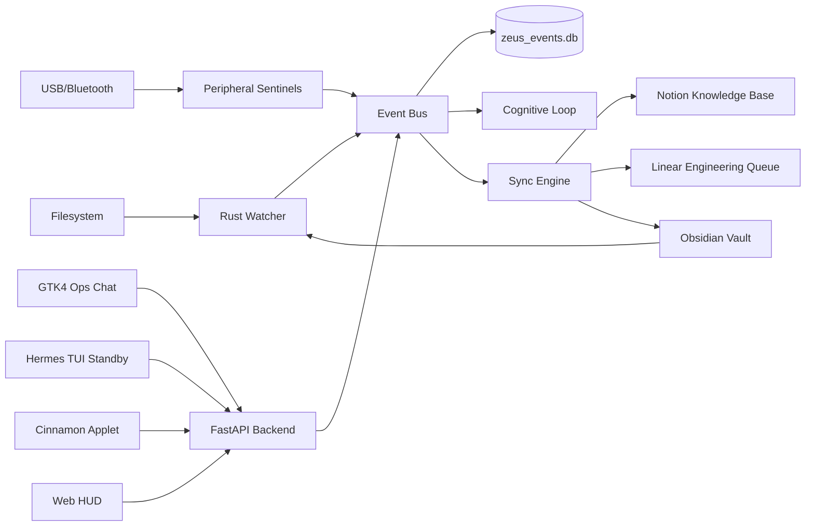
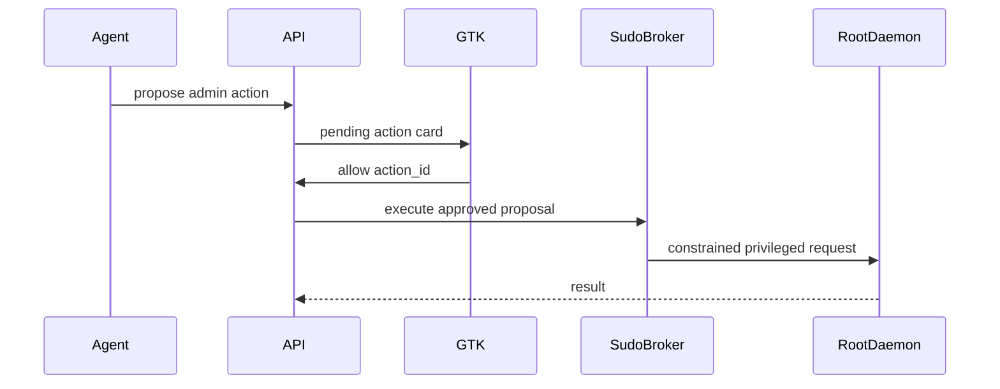

# ZEUS Second Brain Architecture

> Enterprise architecture reference for ZEUS as a bi-directional cognitive operations layer across local files, Obsidian, Notion, Linear, telemetry, and secure desktop execution.

| Area | Role | System of Record |
| --- | --- | --- |
| Perception | File and system sensing | Rust watcher, USB/Bluetooth sentinels |
| Thinking | Local knowledge interface | Obsidian Markdown vault |
| Orchestration | Event routing and decisions | FastAPI backend, EventBus, SQLite |
| Organization | Structured operating knowledge | Notion |
| Execution | Engineering workflow | Linear |
| Operation | Human command surface | Cinnamon applet, GTK4 chat, Web HUD; TUI standby |
| Recall | Conversational context | SQLite conversation memory |

## Strategic Context

The Second Brain turns ZEUS from a reactive assistant into a cognitive operations platform. It preserves the local-first model while allowing selected knowledge and execution signals to move into structured external tools.

The design principles are:

| Principle | Implementation |
| --- | --- |
| Local-first | Markdown, SQLite, local services, LAN locked by default |
| Event-driven | File changes and system events flow through queues and classifiers |
| Auditable | Sync decisions, admin actions, and privileged execution are explicit |
| Resilient | Debounce, cache tables, low-memory controls, and route-level limits |
| Operator-centric | GTK and Cinnamon surfaces are optimized for daily desktop work; TUI stays available as a terminal fallback |

## Reference Architecture



## Operating Flow

1. **Sense:** Rust watcher, USB Sentinel, Bluetooth monitor, web sensing, and local telemetry observe changes.
2. **Normalize:** Events are shaped into consistent payloads and routed through the backend queue.
3. **Classify:** Sync workers and cognitive services determine whether an event is memory-only, Notion-worthy, Linear-worthy, or operationally urgent.
4. **Act:** ZEUS updates memory, generates issues, exports summaries, speaks alerts, or proposes privileged actions.
5. **Audit:** SQLite logs, conversation memory, Notion pages, Linear issues, and admin action records preserve traceability.

## Event Pipeline

| Component | Function | Failure Posture |
| --- | --- | --- |
| `watcher_rs` | High-performance file event stream | External health check and fallback status |
| `OverflowEventQueue` | Bounded event ingestion | Drops oldest when configured for bounded operation |
| `event_batcher` | Aggregates file/system bursts | Prevents noisy UI and excessive downstream work |
| `sync_worker.py` | Processes persisted events | Records pending, processed, and error states |
| `sync_engine.py` | Exports structured memory | Can run selectively per integration |
| `EventBus` | Async pub/sub inside ZEUS | Decouples producers and consumers |

## Knowledge Surfaces

### Obsidian

Obsidian is the local reasoning and inspection layer. Markdown remains human-readable, versionable, and resilient when external APIs are offline.

Supported tags:

| Tag | Action |
| --- | --- |
| `#to-notion` | Export note content into Notion |
| `#to-linear` | Create a Linear issue |
| `#bug` | Create or classify an engineering issue |
| `#performance` | Raise performance-oriented engineering work |
| `#security` | Escalate issue priority when combined with bug/anomaly signals |

### Notion

Notion stores structured operational knowledge:

| Data | Use |
| --- | --- |
| Cognitive profile | Long-term operator and system profile |
| Daily summaries | Executive status and operating cadence |
| Architecture notes | Structured documentation and dashboards |

### Linear

Linear receives execution-ready issues:

| Signal | Output |
| --- | --- |
| Bug tag | Engineering issue |
| Performance anomaly | Optimization work item |
| Security-relevant issue | Higher-priority issue |
| Repeated failures | Stability or self-healing task |

## Conversation Memory

ZEUS maintains a short and medium-term conversational memory in SQLite.

| Field | Purpose |
| --- | --- |
| `session_id` | Keeps a window or client conversation coherent |
| `client_id` | Separates GTK, applet, voice, and API clients |
| `role` | Tracks user and assistant turns |
| `content` | Stores bounded conversation text |
| `created_at` | Enables recent-context retrieval |

Behavior:

- Recent turns from the current session are injected into prompts.
- Similar prior turns are recalled with lightweight lexical matching.
- The GTK client also keeps local SQLite history for operator continuity.
- Prompt growth is controlled by budgeted context blocks.

## Observability

| Surface | Telemetry |
| --- | --- |
| GTK sidebar | CPU, RAM, attention state, privacy shield, mode |
| Thought bar | Current cognitive processing stage |
| Web HUD | Event pulses, OS telemetry, metrics stream |
| TUI standby | Compact terminal fallback for live progress/tool logs |
| Logs | JSON HTTP logs, sync worker traces, security events |

The telemetry model is intentionally split between operational dashboards and persisted system memory. Short-lived UI signals do not automatically become long-term knowledge unless routed through the event pipeline.

## Security And Governance

Privileged operations follow an explicit approval model.



Controls:

| Control | Detail |
| --- | --- |
| Action IDs | UI approval references stored proposals only |
| RootDaemon socket | Unix socket restricted to `0660` |
| Command policy | Tokenized allowlist and risk tiers |
| No raw privileged UI commands | Clients never send arbitrary sudo commands at approval time |
| Self-healing guardrails | Patches and commands pass policy checks |

## Peripheral Sensing

The USB Sentinel is part of the perception layer.

| Event | Treatment |
| --- | --- |
| `usb_device add` | Classify, alert, publish event, speak once |
| `usb_interface add` | Ignored for speech to avoid duplicate alerts |
| Storage class | Medium risk, recommend scan before file access |
| HID class | Medium risk, potential BadUSB-style behavior |
| Network/modem class | High risk, recommend network interface review |
| Removal | Spoken once with cooldown |

The monitor is designed for headless operation and does not require the GTK or Web HUD to be open.

## Configuration

```ini
ZEUS_VAULT_PATH=/home/zeus/Documentos/Brain
ZEUS_DB_PATH=./zeus_events.db
ZEUS_CONVERSATION_DB_PATH=./data/conversation_memory.db

ZEUS_ENABLE_SECOND_BRAIN=1
ZEUS_ENABLE_SECOND_BRAIN_SYNC_ENGINE=0
ZEUS_ENABLE_NOTION_AUTO_SYNC=1
ZEUS_ENABLE_OBSIDIAN_AUTO_SYNC=1
ZEUS_ENABLE_LINEAR_AUTO_SYNC=1

NOTION_TOKEN=secret_xxx
NOTION_DATABASE_ID=xxx
ZEUS_ENABLE_NOTION=true

LINEAR_API_KEY=your_linear_api_key_here
LINEAR_TEAM_ID=xxx
ZEUS_ENABLE_LINEAR=true
```

## Lightweight Mode

The architecture can run without heavy local LLMs or vector stores. In lightweight mode:

| Capability | Behavior |
| --- | --- |
| Watcher | Continues to capture file events |
| Sync worker | Processes persisted queue |
| Conversation memory | SQLite recall remains available |
| External sync | Can be disabled independently |
| Cognitive loop | Resource governor slows or suppresses heavy work |

This keeps the Second Brain useful on constrained machines while preserving the path to richer cognition when resources allow it.
