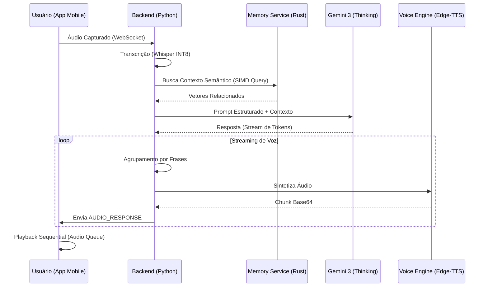
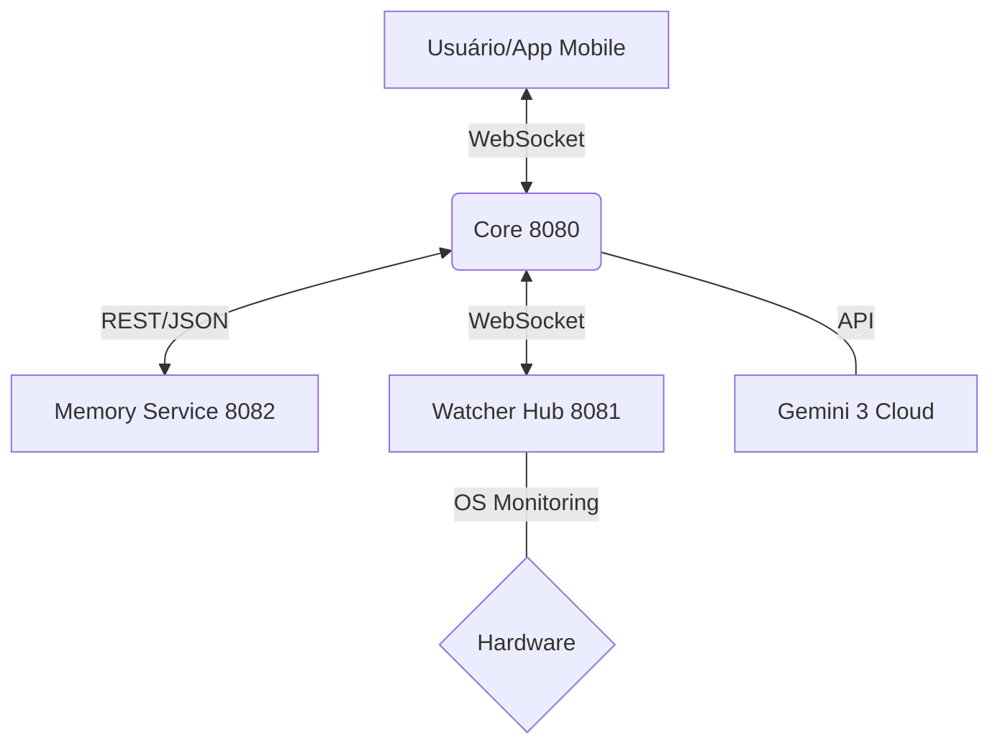

# 🧠 ZEUS SYSTEM — RELATÓRIO TÉCNICO DE ARQUITETURA

## 1. Visão Geral e Finalidade
O **ZEUS** é um Sistema Operacional Cognitivo de alta performance, projetado para integrar inteligência artificial generativa (Gemini 3) com um ecossistema de microsserviços em Rust e uma interface visual de alta fidelidade (Neural HUD). Sua finalidade é prover uma assistência autônoma, rápida e imersiva através de voz e telemetria em tempo real.

---

## 2. Arquitetura de Microsserviços
O sistema foi desacoplado em serviços especializados para garantir baixa latência e resiliência:

| Serviço | Porta | Tecnologia | Finalidade |
| :--- | :--- | :--- | :--- |
| **Core Orchestrator** | 8080 | Python (FastAPI) | Coordena o cérebro (Gemini), lógica de negócios e API Gateway. |
| **Watcher Hub** | 8081 | Rust | Monitora eventos do sistema, logs e telemetria de hardware. |
| **Memory Service** | 8082 | Rust (Axum) | Banco de dados vetorial ultra-rápido com otimização SIMD. |
| **Neural App** | - | Flutter | Interface mobile imersiva focada em comunicação por voz. |

---

## 3. Fluxo de Processamento Neural (Voz)

---

## 4. Dicionário de Arquivos e Processos

### 📂 Apps & Core
*   `apps/web_gui.py`: O coração do sistema. Gerencia as rotas API, conexões WebSocket e a orquestração entre o Gemini e os serviços Rust.
*   `zeus_core/vector_memory.py`: Ponte de comunicação entre o Python e o Microsserviço de Memória. Possui lógica de fallback automático.
*   `communication/voice_service.py`: Gerencia a síntese de voz neural (TTS) usando Edge-TTS com vozes de alta autoridade.

### 📂 Rust Microservices (core-rust/)
*   `core-rust/zeus_memory/src/main.rs`: Servidor REST independente para busca vetorial. Utiliza **Axum** para performance web.
*   `core-rust/zeus_memory/src/lib.rs`: Biblioteca de matemática vetorial. Implementa o cálculo de **Similaridade de Cosseno** otimizado para CPU via SIMD.
*   `watcher_rs/src/main.rs`: Monitor de eventos que distribui telemetria (CPU, RAM, Atividade) para o HUD visual.

### 📂 Mobile (zeus_extension/)
*   `lib/presentation/screens/voice_conversation_screen.dart`: A interface principal. Um HUD minimalista com um Orbe Neural animado (CustomPainter) que reage à voz.
*   `lib/data/voice_service.dart`: Gerencia a fila de reprodução (Audio Queue) para garantir que o streaming de voz seja fluido no celular.

---

## 5. Otimizações de Performance (CPU-Only)
Como o sistema opera sem GPU dedicada, as seguintes camadas foram otimizadas:
1.  **Vetorização SIMD**: O Rust utiliza instruções nativas do processador para calcular similaridades matemáticas em paralelo.
2.  **Quantização INT8**: O modelo ASR (Whisper) foi reduzido para precisão de 8 bits, dobrando a velocidade em processadores convencionais.
3.  **Multi-threading**: O uso de `rayon` no Rust permite que a memória seja vasculhada usando todos os núcleos da CPU simultaneamente.

---

## 6. Diagrama de Conectividade do Sistema

---
*Relatório gerado automaticamente pelo Sistema Antigravity para documentação do ZEUS Cognitive OS.*
